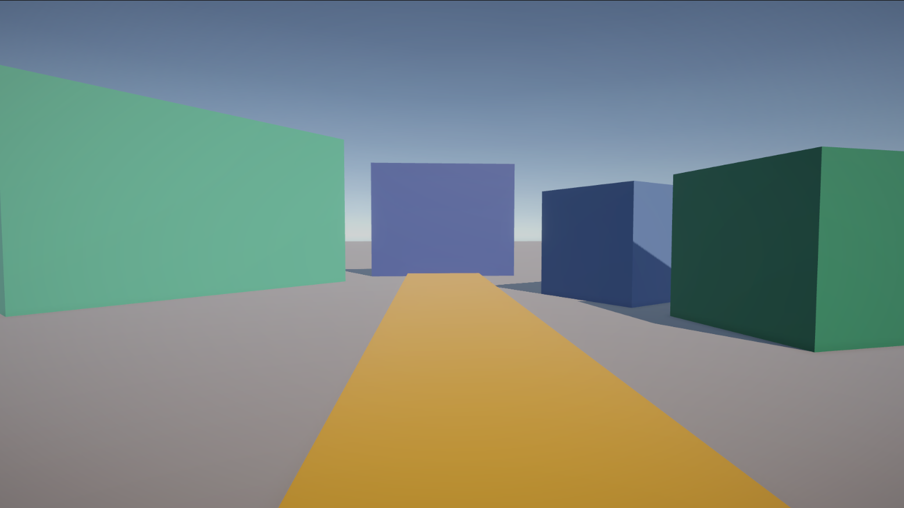
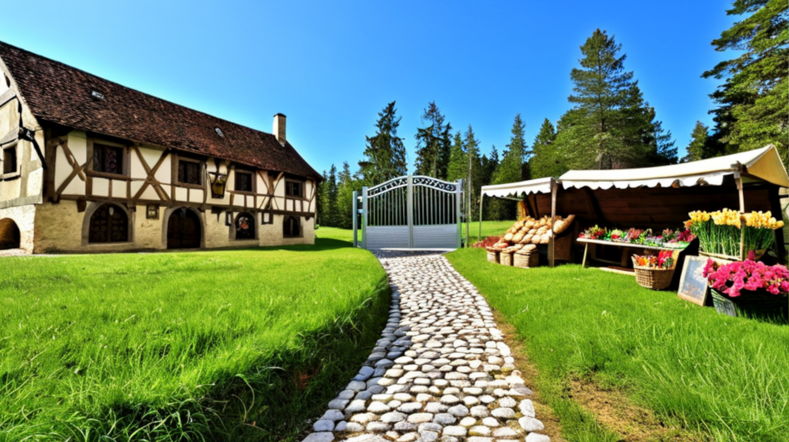

# UnitySDCN Pipeline
Work-in-progress pipeline to generate high-quality visuals for barebones 3D environments 
in Unity URP through the usage of Stable Diffusion & ControlNet.

## Preview
Unity URP demo scene       |  Post visualization
:-------------------------:|:-------------------------:
 |  

## Usage
1. Install the NPM packages in the `comfyui-server` folder using `npm i` (tested with Node v20)
2. Run your ComfyUI instance, where you have the following custom nodes installed: 
    - [ComfyUI-Tooling-Nodes](https://github.com/Acly/comfyui-tooling-nodes)
    - [ControlNet-LLLite-ComfyUI](https://github.com/arthurb123/ControlNet-LLLite-ComfyUI)
3. Edit the `comfyui-server/config.json` file such that all fields are correct (primarily, the address and model names)
4. Install the UnitySDCN package from the `unity-plugin/Packages/UnitySDCN` folder to your URP project, or open the demo scene located in the `unity-plugin` project.
5. Modify the scene and use the `SDCNManager` game object to generate images.

## Models
<ins>ControlNet SD1.5</ins>
* Depth: https://huggingface.co/lllyasviel/sd-controlnet-depth
* Normal: https://huggingface.co/lllyasviel/sd-controlnet-normal

<ins>ControlNet SDXL</ins>
* Depth: https://huggingface.co/diffusers/controlnet-depth-sdxl-1.0
* Normal: https://huggingface.co/bdsqlsz/qinglong_controlnet-lllite

## Roadmap
* Add region ordering based on camera-object distance metric
* If a ComfyUI plugin ever arrives, implement Flux.1 support using: https://github.com/instantX-research/Regional-Prompting-FLUX